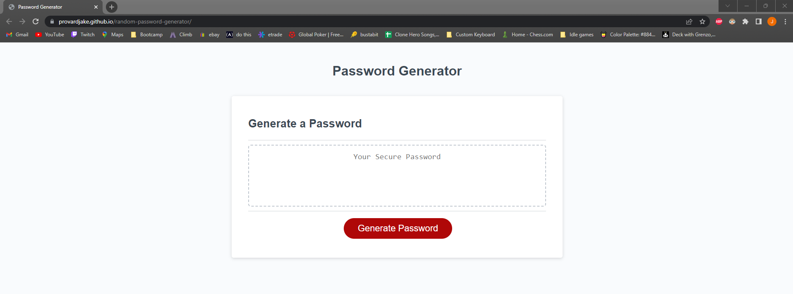

# random-password-generator
The goal of this project was to allow a user to generate a random password when they click on the Generate Password button and given certain criteria for the password such as length and charater types to include.

# Screenshot of deployed application

# URL for applicaiton
https://provardjake.github.io/random-password-generator/